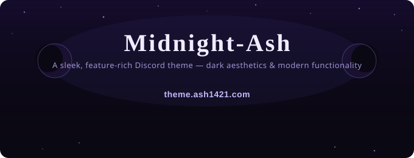

<div align="center">
  
</div>

---

## ✨ Socials & Stars

[](https://rb.ash1421.com/discord)
[](https://github.com/Ash1421/Midnight-Ash/stargazers)

## 💜 Donations & Funding

#### Donations and or support are appreciated very much!

#### If you would like to show love to the creator of this project or this project in general, please consider helping fund the development of this project by donating on Ko-fi.

[](https://kofi.ash1421.com)

## Github Repository Information

[](https://github.com/Ash1421/Midnight-Ash/releases/latest)
[](https://www.codefactor.io/repository/github/ash1421/midnight-ash)
[](https://github.com/Ash1421/Midnight-Ash/releases)
[](https://github.com/Ash1421/Midnight-Ash/releases/latest)
[](https://github.com/Ash1421/Midnight-Ash/issues)
[](https://github.com/Ash1421/Midnight-Ash/issues?q=is:closed)
[](https://github.com/Ash1421/Midnight-Ash/issues/new/choose)

## ❤️ Made With love using

[](https://opensource.org/about)
[](https://daringfireball.net/projects/markdown/)
[](https://developer.mozilla.org/en-US/docs/Web/CSS)
[](https://developer.mozilla.org/en-US/docs/Web/HTML)
[](https://pages.github.com/)
[](https://www.gnu.org/)
[](https://shields.io/)
[](https://www.codefactor.io/)
[](https://nodejs.org/)
[](https://www.json.org/json-en.html)
[](https://developer.mozilla.org/en-US/docs/Web/JavaScript)

## 📜 Licensed Under

[](./LICENSE)

## ✨ What's Included

🖤 **Midnight-AMOLED** - Pure black backgrounds that are easy on OLED displays  
⚙️ **Settings Modal** - Clean modal windows for settings instead of sidebars  
🔘 **Radial Status** - Beautiful circular status rings around avatars  
📱 **Horizontal Server List** - Servers displayed at the top for better screen usage  
🍎 **Apple Emojis** - Clean, modern Apple emoji replacements

## 📖 Information About This Theme

This theme has been made with **my preference in mind** and features the best of dark aesthetics and modern functionality. It offers customization, documentation, support, and instructions for most modern clients. The theme is made with a purple-themed color palette, animations, and features from included themes — such as Radial Status for better visibility of other user's current status, a Settings Modal for a cleaner and more modern Discord settings interface with improved transparency and readability, a horizontal server list for better screen usage, and emoji replacement for a cleaner and more modern look.

I have tried to keep the theme relatively small, simple, and clean for speedy load times on laptops and low-end PCs, and even phones, while maintaining easy use and modification of the theme through documentation, links, support, and issues.

## 🚀 Installation

### 🔗 Copy this URL into your Discord client

```
https://theme.ash1421.com/midnight-ash.css
```

<!-- [](discord://-/settings/equicord_themes)
<sub>Opens the Discord desktop app to Settings — then click **Equicord/Vencord → Themes** to load the theme. Desktop app only.</sub> -->

#### 👋 Help Guide

To download and install for most modern clients, copy the URL above and paste or type it into the required field, then load, toggle, reload, or restart to refresh the theme. For more help, please view the client-specific instructions.

For file based installs please download the CSS file and move it to the required path.

Using the latest version could help with optimizations and other features that have been added and/or documented.

### ✋ For more help please use a browser or tutorial to find what you need

#### ⬇️ To download the CSS file click the version badge, go to the latest release or click on this link: [Latest Release](https://github.com/Ash1421/Midnight-Ash/releases/latest)

## 📱 Client-Specific Instructions

### Recommended Clients

#### ⭐ Equicord - **Recommended Client**

Website: https://equicord.org/
GitHub: https://github.com/Equicord/Equicord

1. Open Discord settings
2. Go to `Equicord` → `Themes`
3. Click `Online Themes`
4. Paste the URL above and click `Add Theme`

#### 🎯 **Vencord** **(Web Support)**

Website: https://vencord.dev/
GitHub: https://github.com/Vendicated/Vencord

**(Web Versions)**

Vencord Web Chrome Extension: https://chromewebstore.google.com/detail/vencord-web/cbghhgpcnddeihccjmnadmkaejncjndb

Vencord Web Userscript: https://raw.githubusercontent.com/Vencord/builds/main/Vencord.user.js

1. Open Discord settings
2. Go to `Vencord` → `Themes`
3. Click `Online Themes`
4. Paste the URL above and click `Add Theme`

#### 🔧 **BetterDiscord**

Website: https://betterdiscord.app/
GitHub: https://github.com/BetterDiscord/BetterDiscord

1. Download the `.css` file from the repository
2. Place it in your BetterDiscord themes folder
3. Or use `Settings` → `Themes` → `Load from URL`

---

<details>
<summary><h3>💻Other Clients<h3></summary>

#### 🔌 **Replugged**

Website: https://replugged.dev/
GitHub: https://github.com/replugged-org/replugged

1. Open Discord settings
2. Go to `Replugged` → `Themes`
3. Click `Install from URL`
4. Paste the URL and install

#### 💻 **Legcord**

Website: https://legcord.app/
GitHub: https://github.com/Legcord/Legcord

1. Go to `Settings` → `Themes`
2. Click `Load Theme`
3. Enter the URL or upload the `.css` file

#### 🌐 **WebCord**

GitHub: https://github.com/SpacingBat3/WebCord

1. Navigate to your WebCord themes folder
2. Download and place the `midnight-ash.css` file
3. Restart WebCord and enable the theme

#### 📦 **OpenAsar** (with Equicord/BD/Vencord)

Website: https://openasar.dev/
GitHub: https://github.com/GooseMod/OpenAsar

Compatible with BetterDiscord, Equicord or Vencord installation methods.

</details>

<details>
<summary><h3>📊 Performance & Import Sizes 📦</h3></summary>

> These results are approximate (~) and may change if upstream themes or `midnight-ash.css` are updated.
> Load times measured via Discord DevTools Network tab with cache disabled.

| Import                  | Load Time | Transfer Size |
| ----------------------- | --------- | ------------- |
| `midnight-ash.css`      | ~42ms     | ~2.02 KB      |
| `midnight-discord`      | ~54ms     | ~16.35 KB     |
| `amoled-cord`           | ~44ms     | ~4.91 KB      |
| `RadialStatus`          | ~42ms     | ~2.17 KB      |
| `SettingsModal`         | ~44ms     | ~1.72 KB      |
| `HorizontalServerList`  | ~44ms     | ~0.75 KB      |
| `Apple Emojis`          | ~249ms    | ~0.53 KB      |
| `Font Awesome Moon SVG` | ~123ms    | ~0.75 KB      |
| **Total**               |           | **~29.20 KB** |

> Sizes may change if upstream themes or `midnight-ash.css` are updated, therefore the sizes are approximate (~).
> Sizes measured via a custom Node.js script against the full uncompressed and gzipped CSS files.

| Import                 | Uncompressed   | Gzipped       |
| ---------------------- | -------------- | ------------- |
| `midnight-discord`     | ~79.01 KB      | ~15.86 KB     |
| `amoled-cord`          | ~28.63 KB      | ~4.46 KB      |
| `RadialStatus`         | ~8.33 KB       | ~1.91 KB      |
| `SettingsModal`        | ~7.81 KB       | ~1.36 KB      |
| `HorizontalServerList` | ~1.65 KB       | ~614 B        |
| `Apple Emojis`         | ~1.34 KB       | ~343 B        |
| **Total**              | **~126.76 KB** | **~24.40 KB** |

</details>

## ⚙️ Customization Documentation

### 🔓 Editing The Theme yourself ⚠️

To change the accent color, also known as the main color, please use the following information below for assistance in changing it to your favorite color or adding your own if you know what you are doing.

To change anything listed below please open the css file you have downloaded in a text or code editor and edit the according options to the values you like or want.

**To change any options below is at your own risk and could cause the theme to break if not done correctly, please report issues if found and use documentation. You have been warned.**

---

<details>
<summary><h3>⚙️ Customization Options</h3></summary>

### Settings Modal

- `--settingswidth`: Width in pixels (default: 960)
- `--settingsheight`: Height in vh (default: 80)
- `--settingsbackground`: Background color (default: transparent)

### Radial Status Rings

- `--rs-small-width`: Status ring thickness (default: 2px)
- `--rs-avatar-shape`: Avatar shape (default: 50% = round, 0% = square)
- `--rs-phone-color`: Phone status ring color (default: var(--rs-online-color))
- `--rs-phone-visible`: Visibility of phone status ring (default: block)

### Horizontal Server List

- `--HSL-server-direction`: Direction of server list (default: column)
- `--HSL-server-alignment`: Alignment of server list (default: flex-start)

### Theme Colors

- `--purple-1`: Lightest purple (default: oklch(75% 0.11 310deg))
- `--purple-2`: Light purple (default: oklch(70% 0.11 310deg))
- `--purple-3`: Medium purple (default: oklch(65% 0.11 310deg))
- `--purple-4`: Dark purple (default: oklch(60% 0.11 310deg))
- `--purple-5`: Darkest purple (default: oklch(55% 0.11 310deg))

---

- `--green-1`: Lightest green (default: oklch(75% 0.11 170deg))
- `--green-2`: Light green (default: oklch(70% 0.11 170deg))
- `--green-3`: Medium green (default: oklch(65% 0.11 170deg))
- `--green-4`: Dark green (default: oklch(60% 0.11 170deg))
- `--green-5`: Darkest green (default: oklch(55% 0.11 160deg))

---

- `--blue-1`: Lightest blue (default: oklch(75% 0.1 215deg))
- `--blue-2`: Light blue (default: oklch(70% 0.1 215deg))
- `--blue-3`: Medium blue (default: oklch(65% 0.1 215deg))
- `--blue-4`: Dark blue (default: oklch(60% 0.1 215deg))
- `--blue-5`: Darkest blue (default: oklch(55% 0.1 215deg))

---

- `--yellow-1`: Lightest yellow (default: oklch(80% 0.11 90deg))
- `--yellow-2`: Light yellow (default: oklch(75% 0.11 90deg))
- `--yellow-3`: Medium yellow (default: oklch(70% 0.11 90deg))
- `--yellow-4`: Dark yellow (default: oklch(65% 0.11 90deg))
- `--yellow-5`: Darkest yellow (default: oklch(60% 0.11 90deg))

---

- `--red-1`: Lightest red (default: oklch(75% 0.12 0deg))
- `--red-2`: Light red (default: oklch(70% 0.12 0deg))
- `--red-3`: Medium red (default: oklch(65% 0.12 0deg))
- `--red-4`: Dark red (default: oklch(60% 0.12 0deg))
- `--red-5`: Darkest red (default: oklch(55% 0.12 0deg))

### Accents

- `--accent-1`: Accent 1 (default: var(--purple-1))
- `--accent-2`: Accent 2 (default: var(--purple-2))
- `--accent-3`: Accent 3 (default: var(--purple-3))
- `--accent-4`: Accent 4 (default: var(--purple-4))
- `--accent-5`: Accent 5 (default: var(--purple-5))
- `--accent-new`: Accent new (default: var(--accent-2))

### Custom DMs Icon

- `--custom-dms-icon`: Custom DMs icon (default: custom)
- `--dms-icon-svg-url`: SVG URL for custom DMs icon (default: url("https://refact0r.github.io/midnight-discord/assets/Font_Awesome_5_solid_moon.svg"))

### Fonts

- `--font`: Font family (default: "figtree")
- `--code-font`: Code font family (default: "")
- `--font-weight`: Font weight (default: 400)

### Animations

- `--animations`: Animations (default: on)

### Custom Window Controls

- `--custom-window-controls`: Custom window controls (default: on)

</details>

<details>
<summary><h3>📸 Screenshots of the theme in action</h3></summary>

The screenshots below show the theme in action when it is correctly loaded.

<div style="text-align: center;">
  
  
  
</div>

</details>

### 🌑 AMOLED-Optimized

- Pure black backgrounds (`#000000`) for OLED displays
- Subtle white accents for better contrast
- Reduced eye strain in dark environments

### 📐 Modal Settings

- Customizable width and height
- Clean, centered design
- Better focus and organization

### 🔘 Enhanced Status Indicators

- Circular rings around avatars
- Color-coded for different statuses
- Clean, modern, visible, and functional appearance

### 📊 Horizontal Layout

- Server list moved to top
- More vertical space for chat
- Modern, streamlined appearance

## 🐛 Issues & Support

Found a bug? Have a suggestion?

- 🐛 [Report a Bug](https://github.com/Ash1421/Midnight-Ash/issues/new/choose)
- ✨ [Request a Feature](https://github.com/Ash1421/Midnight-Ash/issues/new/choose)
- 📖 [Documentation Issue](https://github.com/Ash1421/Midnight-Ash/issues/new/choose)
- ❓ [Ask a Question](https://github.com/Ash1421/Midnight-Ash/issues/new/choose)
- 🔒 [Report a Security Vulnerability](https://github.com/Ash1421/Midnight-Ash/security/advisories/new)
- 💬 [Open a Ticket](https://rb.ash1421.com/discord)

## 📜 License

This project is licensed under the [GPL v3.0](./LICENSE) (GNU General Public License V3.0).

It also incorporates components from other open-source projects under MIT or GPLv2 licenses:

| Component                              | Author                | License                                           |
| -------------------------------------- | --------------------- | ------------------------------------------------- |
| Midnight Discord Theme                 | refact0r              | [MIT](./ORIGINAL_LICENSES/LICENSE_refact0r.md)    |
| AMOLED-Cord                            | LuckFire              | [MIT](./ORIGINAL_LICENSES/LICENSE_LuckFire.md)    |
| Settings Modal / Emoji Replace         | DevilBro              | [GPL v2](./ORIGINAL_LICENSES/LICENSE_DevilBro.md) |
| Radial Status / Horizontal Server List | Gibbu / DiscordStyles | [MIT](./ORIGINAL_LICENSES/LICENSE_Gibbu.md)       |

See the [ORIGINAL_LICENSES/](./ORIGINAL_LICENSES) directory for full unmodified license texts.

These incorporated works remain under their original licenses (MIT or GPLv2), compatible with the GNU General Public License v3.0 under which this combined project is released.

The only things that have been modified from the license files is the names of the files and file types for organization, other than that, the license texts are the same as the original authors.

## 📝 Acknowledgement

**If you plan on using, editing, or redistributing this theme, please give credit to the original authors.**

## ⚠️ Disclaimer

**By using, editing, or publishing this theme you are acknowledging that you have read and understand the license terms and conditions of using the provided files, and that you agree to be bound by the terms of the license.**

**Using the provided Discord Clients is at your own risk, please use at your own discretion of your discord account and your computer.**

## 🙏 Credits

- **Midnight Theme** - [@refact0r](https://github.com/refact0r)
- **AMOLED-Cord** - [@LuckFire](https://github.com/LuckFire)
- **Settings Modal** - [@DevilBro](https://github.com/mwittrien)
- **Radial Status** - [@Gibbu](https://github.com/DiscordStyles)
- **Horizontal Server List** - [@Gibbu](https://github.com/DiscordStyles)
- **Emoji Replace** - [@DevilBro](https://github.com/mwittrien)

- **Thanks to all the contributors on [GitHub](https://github.com/Ash1421/Midnight-Ash/graphs/contributors)**

---

## 💵 Support me and or my projects

<table width="100%" style="border-collapse: collapse; border: 1px solid #ddd;">
  <tr>
    <td align="center" style="border: 1px solid #ddd; padding: 15px; vertical-align: top;">
      <h3>💜 Donations and support are appreciated very much!</h3>
      <p><strong>Minimum donation:</strong> $5 (NZD)</p>
      <p><strong>Payment methods:</strong> Credit/Debit Card, PayPal, Apple Pay, Google Pay</p>
      <p><strong>Supported Cards:</strong> Visa, Mastercard, Amex / American Express</p>
      <p>Membership options are <strong>available</strong> for recurring support.</p>
      <p><strong>You can donate via:</strong></p>
      <a href="https://kofi.ash1421.com">
        
      </a>
    </td>
    <td align="center" style="border: 1px solid #ddd; padding: 15px; vertical-align: top;">
      <h3 style="color:#553BBB;">💜 Supported Payment Methods:</h3>
      <div style="margin-bottom:8px;">
        <div>
          <a href="https://www.visa.co.nz/">
            
          </a>
          <a href="https://www.mastercard.co.nz/">
            
          </a>
          <a href="https://www.americanexpress.com/newzealand/">
            
          </a>
        </div>
        <div>
          <a href="https://www.paypal.com/nz/">
            
          </a>
          <a href="https://www.apple.com/nz/apple-pay/">
            
          </a>
          <a href="https://pay.google.com/intl/en_nz/about/">
            
          </a>
        </div>
      </div>
    </td>
  </tr>
</table>

---

**Made with 💜 by [@Ash1421](https://github.com/Ash1421), for the Discord community.**

⭐ **Star this repo if you like it!** ⭐

</div>
